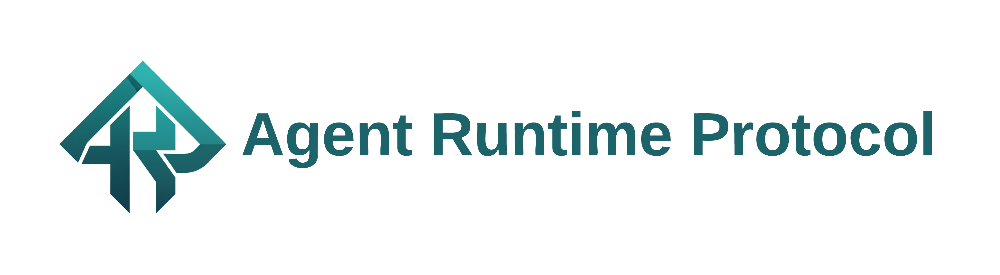

<div align="center">
  <a href="https://agent-runtime-protocol.com/">
    <picture>
      <source srcset="./images/ARP_Long_Transparent.png">
      
    </picture>
  </a>
</div>

<div align="center">
  <h3>The open, modern, modular standard for agentic system.</h3>
</div>

<div align="center">
  <a href="https://opensource.org/licenses/MIT" target="_blank"></a>
  <a href="https://pypistats.org/packages/arp-standard-py" target="_blank"></a>
  <a href="https://pypi.org/project/arp-standard-py/#history" target="_blank"></a>
  <a href="https://www.reddit.com/r/AgentRuntimeProtocol/" target="_blank"></a>
   
</div>
<div align="center">
  <a href="https://vscode.dev/redirect?url=vscode://ms-vscode-remote.remote-containers/cloneInVolume?url=https://github.com/agentruntimeprotocol/ARP_Standard" target="_blank"></a>
  <a href="https://codespaces.new/agentruntimeprotocol/ARP_Standard" target="_blank"></a>
</div>

---

_**Agent Runtime Protocol**_ is an open standard for running agentic workflows in a consistent way across runtimes, tools, model providers, environments, and even protocols. It is built to be open, modular, adaptive, and distributed. 

ARP is:
- **Language-agnostic**: the standard is defined as contracts, not as a single SDK.
- **Cloud/model-agnostic**: designed to support multiple deployment environments and model providers. Components can live close or far from each other.
- **Modular**: every component can be swapped out (runtimes, tool registries, orchestrators, control planes).
- **Standard-first**: contracts are the product wedge; implementations exist to validate and accelerate adoption.
- **Interoperable**: alternative protocols like *MCP* and *A2A* can interact with or be incorporated in the ARP ecosystem with simple, often first-party wrappers.

## What's in this repo

- Current standard: [`spec/v1/`](spec/v1/README.md)
- Docs: [`docs/`](docs/README.md)
- Generated SDKs : [`sdks/python/`](sdks/python/README.md)
- Tooling (codegen, validation): [`tools/`](tools/)

## Start here

If you want the exact contracts:
- Read the ARP Standard: [`spec/v1/`](spec/v1/README.md)
- Play with the generated SDK to see the contracts in action.
- Optionally, the docs: [`docs/README.md`](docs/README.md)

If you want something runnable:
- Use [JARVIS](https://github.com/AgentRuntimeProtocol/JARVIS_Release), the first‑party reference stack with *Runtime* + *Tool Registry* + *Daemon*.
- JARVIS exists not only as a product, but also as an validation of the standard and to provide a working reference implementation.

## Why ARP

Most agent systems today carry one or more of the following risks:
- Framework-specific: it is hard to swap out runtime/tool stacks.
- Product-specific: coupled to a vendor’s hosted platform.
- Integration-heavy: every agent and tool combination needs custom wiring.

ARP’s goal is to make agent ecosystems composable:
- A runtime implements the ARP Runtime API.
- A tool provider exposes tools via the ARP Tool Registry API.
- A daemon orchestrates and manages runtime instances and routes runs across them.
- Any compliant client can talk to any compliant component.

Unlike monolithic agent systems, you can adopt ARP incrementally:
1) Wrap an existing agent as an ARP Runtime.
2) Expose your tools as an ARP Tool Registry (or as a tool module that any tool registry can consume).
3) Add a Daemon for orchestration and fleet management.
4) Add a Control Plane when you need policy, tenancy, and operations (managing daemons and tool registries).

## Interoperability with other standards

ARP is designed to interoperate, not compete in a silo.

Examples:
- Tool ecosystems: use adapters to MCP (tool servers) behind an ARP Tool Registry.
- Agent-to-agent: bridge to A2A-style communication where needed.
- Agent-as-a-service: provide facades compatible with Agent Protocol style APIs.

Some of these adapters are being built in the first-party *JARVIS* stack. ARP is not a walled garden—it is meant to work with existing and upcoming standards, and can serve as a “glue layer” between them.

## Design principles

Standard design goals:
- Strong contracts: explicit schemas, consistent error envelopes, stable versioning.
- Forward compatibility: flexible extension points for new feature needs.
- Capability discovery: clients can detect supported feature sets to avoid lockstep upgrades.
- Conformance testing in SDKs: generated SDKs are validated against the schemas to provide reliable artifacts that adhere to the standard.

## SDKs

SDKs are client-focused libraries for talking to ARP components (Runtime, Tool Registry, Daemon). Use them to easily communicate with any ARP-compliant component.

They’re also useful for integration/conformance testing: write tests that call your service via the SDK and validate behavior against the contracts.

### Language support

Currently, a Python SDK package is published:
- Python: [`arp-standard-py`](sdks/python/README.md) (imported as `arp_sdk`)

Other SDKs (JavaScript, Go, etc.) are planned/in progress.

### Install (Python)

```bash
python3 -m pip install arp-standard-py
```

### Quick example

```python
from arp_sdk.daemon import DaemonClient
from arp_sdk.models import InstanceCreateRequest

client = DaemonClient(base_url="http://127.0.0.1:8082")
created = client.create_instances(InstanceCreateRequest(runtime_profile="default", count=1))
print(created.to_dict())
```

### Code generation

The spec in [`spec/v1/`](spec/v1/README.md) is the source of truth for the ARP Standard. Code generation pipelines read the contracts (OpenAPI + JSON Schemas) and generate language-specific SDKs automatically at release time.

The generated artifacts are validated against the spec schemas and published to their corresponding package providers (for example, `PyPI` for Python).

> [!NOTE]
> Never manually edit generated files. They will be overwritten by new generations.

For SDK developers, see [`tools/codegen/python/README.md`](tools/codegen/python/README.md).

## Versioning

ARP uses versioned API namespaces (Kubernetes-style):
- `v1` (stable)

All endpoints in the v1 spec are versioned under the `/v1` path prefix (e.g. `GET /v1/health`).

## Docs

- Docs index: [`docs/README.md`](docs/README.md)
- Spec overview: [`docs/spec.md`](docs/spec.md)
- Services overview: [`docs/services.md`](docs/services.md)
- Conformance: [`docs/conformance.md`](docs/conformance.md)
- Python SDK: [`docs/python-sdk.md`](docs/python-sdk.md)

## Contributing

See [`CONTRIBUTING.md`](CONTRIBUTING.md).

Ways to contribute:
- Add conformance tests and golden vectors to expand SDK validation coverage.
- Build interoperability bridges (MCP, A2A, Agent Protocol) and feed back schema needs.
- Propose standard changes backed by concrete implementation evidence.
- Any other things that the core devs didn't think of. We know there's a lot.

Contribution model:
- Standards changes should be justified by real implementation evidence (e.g., “I tried X in an ARP‑compliant way, but Y made it impossible; Z would fix it.”).
- Prefer prototyping new needs via `extension` fields first; once proven, propose moving them into normative fields in a future version.

## Security

If you find a security issue, please send a private communication to the maintainers, or file an issue with minimal detail and request an owner contact. Do not discuss security issues in public forums.

## License

MIT License applies to this repo. See [`LICENSE`](LICENSE).
